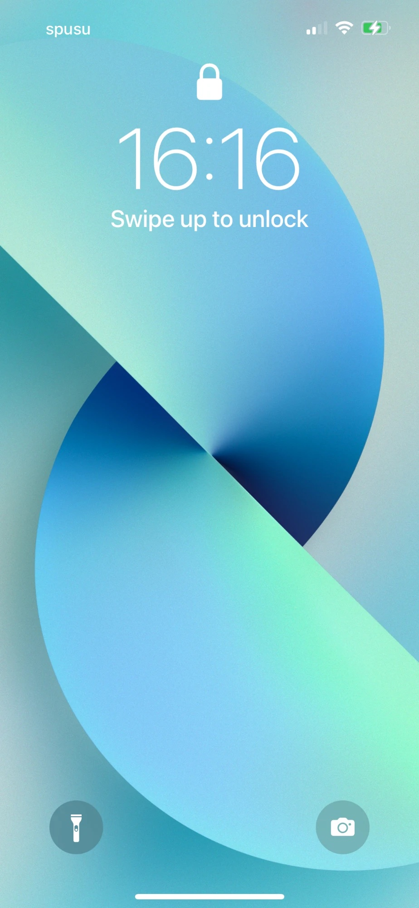
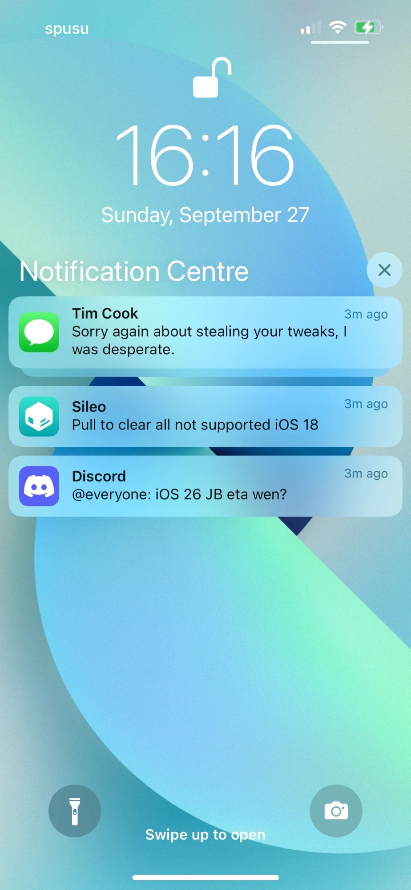
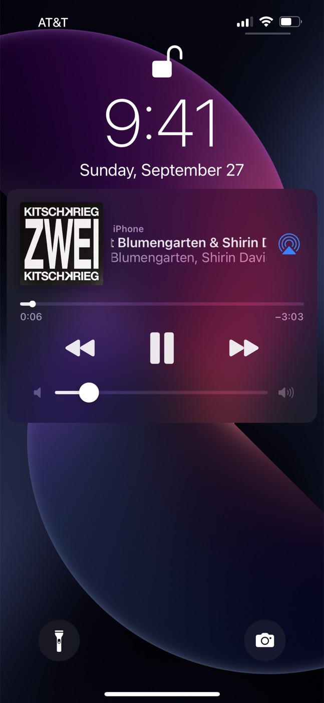
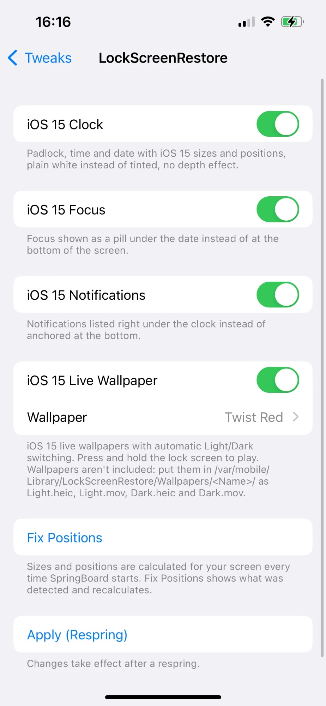

# LockScreenRestore

Brings the iOS 15 lock screen back to iOS 16: clock, notifications, music player, live wallpapers and the old **Settings → Wallpaper** page.

> [!IMPORTANT]
> **This is a beta.** So far it's been tested on an **iPhone 13 Pro (iOS 16.1.1)** and an **iPhone 12 Pro (iOS 16.5)**, both with Dopamine. Positions are calculated for every screen, but other screen sizes haven't been checked yet.
>
> **Feedback is very welcome:** if you try it on a different iPhone or iOS 16 version, please [open an issue](../../issues) with your model, iOS version, jailbreak and a screenshot, even if everything looks right. That's how the [compatibility table](#compatibility) gets filled in.

<p align="center">
  
  &nbsp;
  
  &nbsp;
  
  &nbsp;
  
</p>
<p align="center"><sub>Lock screen · Notifications · Music player · Settings</sub></p>

## Contents

- [What it changes](#what-it-changes)
- [Settings](#settings)
- [Wallpapers](#wallpapers)
- [Compatibility](#compatibility)
- [Installation](#installation)
- [Known limitations](#known-limitations)
- [Building from source](#building-from-source)
- [How positions are calculated](#how-positions-are-calculated)

## What it changes

Every part has its own switch, so you can mix iOS 15 and iOS 16 however you like.

| Part | iOS 16 | With LockScreenRestore |
|---|---|---|
| Clock | Big bold clock, date above it, tinted | Thin iOS 15 clock, "Sunday, September 27" below it, plain white |
| Padlock | Small, fades away after Face ID | Big, stays open after Face ID |
| Focus | Name at the bottom of the screen | Pill under the date |
| Notifications | Collected at the bottom | Listed right under the clock, iOS 15 cards |
| Music player | Compact Live Activity | iOS 15 player with volume slider |
| Charging | Battery drawn under the padlock | Battery where the clock is |
| Wallpaper | Posters, no live wallpapers | Live wallpapers, iOS 15 wallpaper settings |

### 🕘 iOS 15 Clock


- Thin clock with the date **below** it, written out as "Sunday, September 27"
- Plain white text instead of iOS 16's tinted, slightly see-through look
- Big padlock that **stays open** after Face ID instead of shrinking away
- No depth effect: the wallpaper no longer covers the clock
- No lock screen widgets (iOS 15 had none)
- When you plug in, the charging battery appears where the clock is, like on iOS 15
- Sizes and positions adapt to your iPhone's screen ([how](#how-positions-are-calculated))

### 🌙 iOS 15 Focus

- The Focus pill sits under the date (tap it to switch Focus), instead of the Focus name at the bottom of the screen

<br clear="right">

### 🔔 iOS 15 Notifications


- Notifications are listed **right under the clock** instead of collected at the bottom
- iOS 15 card shape: smaller rounded corners (13 pt instead of 23.5 pt), tighter padding, one-line cards 58 pt tall instead of 66 pt
- iOS 15's narrower side margins
- Swipe up to see older notifications: the **Notification Centre** header with its ✕ button only appears then, like on iOS 15, and never flashes while unlocking

<br clear="right">

### 🎵 iOS 15 Music Player


- The iOS 15 layout: large artwork, device name above the title, **AirPlay** next to the title
- Progress bar with a knob and the times below it
- Bigger play/pause, previous and next buttons
- **Volume slider** (iOS 16 removed it from the lock screen)
- "Artist — Album" under the title instead of only the artist
- Tapping the artwork no longer switches the lock screen to iOS 16's full-screen album art

<br clear="right">

### 🖼️ iOS 15 Live Wallpaper

- **Live wallpapers are back** (iOS 16 removed them): press and hold the lock screen to play
- Switches automatically between the Light and Dark version with the system appearance
- **Settings → Wallpaper is the iOS 15 page again:**
  - *Choose a New Wallpaper*, a lock screen and a home screen preview side by side, and *Dark Appearance Dims Wallpaper*
  - *Choose* shows **Dynamic · Stills · Live** at the top and your photo albums below
  - Wallpapers show their Light and Dark version side by side, like on iOS 15
  - Tap one to preview it, then **Set Lock Screen**, **Set Home Screen** or **Set Both**
  - Photos keep **Move & Scale**; Live Photos play when you press and hold
- Lock screen and home screen can have **different wallpapers**
- Changes apply right away, no respring needed
- Apple's iOS 14/15 wallpapers can be **downloaded right in Settings → Wallpaper**, see [Wallpapers](#wallpapers)

## Settings


**Settings → Tweaks → LockScreenRestore**

| Switch | Default | Off means |
|---|---|---|
| iOS 15 Clock | On | iOS 16 clock, date and padlock |
| iOS 15 Focus | On | Focus at the bottom again |
| iOS 15 Notifications | On | iOS 16 notification list |
| iOS 15 Music Player | On | iOS 16 player |
| iOS 15 Live Wallpaper | On | iOS 16 wallpapers, lock screen editor and Settings → Wallpaper page |

Switches take effect after a respring: tap **Apply (Respring)** at the bottom of the page.

**Fix Positions** shows which iPhone and screen size were detected and recalculates all positions with a respring. The tweak also does this by itself every time SpringBoard starts.

Wallpapers are picked in **Settings → Wallpaper**, not here.

<br clear="right">

## Wallpapers

Apple's wallpapers are copyrighted, so they're **not part of this repository or the package**. Instead, **Settings → Wallpaper → Choose a New Wallpaper → Stills / Live** lists them under **Available to Download**:

1. Scroll down to **Available to Download** (wallpapers with a ☁️ icon).
2. Tap one. It downloads the version made for your screen size and opens the preview.
3. Tap **Set** and pick Lock Screen, Home Screen or Both.

The list comes from [SniperGER/iOS-Wallpapers](https://github.com/SniperGER/iOS-Wallpapers), an archive of Apple's official wallpapers: the iOS 14/15 live wallpapers (Orbs, Resonance, Light Beams, Twist) and stills like Desert, Lake, Earth, Flowers and WWDC. Each thumbnail downloads the full image once (1–5 MB), so use Wi-Fi when scrolling through the list the first time.

**Photos** from your library work too, with Move & Scale.

<details>
<summary>Adding wallpapers by hand</summary>

Each wallpaper is a folder with the still image and the video for Light and Dark:

```
/var/mobile/Library/LockScreenRestore/Wallpapers/
└── Light Beams Blue/
    ├── Light.heic
    ├── Light.mov
    ├── Dark.heic
    └── Dark.mov
```

- The folder name is the name shown in Settings → Wallpaper.
- With only `Light.heic` and `Dark.heic` it appears under **Stills**; with the `.mov` files too, it also appears under **Live**.

</details>

**Dynamic** is empty for now.

If you'd rather keep iOS 16's wallpapers, turn **iOS 15 Live Wallpaper** off: that also brings back iOS 16's Settings → Wallpaper page and the lock screen editor.

## Compatibility

Rootless jailbreaks on **iOS 16 only**. Tested with Dopamine and ElleKit on iOS 16.1.1 and 16.5; other iOS 16 versions and jailbreaks are untested.

| iPhone | Screen | Status |
|---|---|---|
| iPhone 13 Pro | 390 × 844 pt | ✅ Tested (iOS 16.1.1) |
| iPhone 12 Pro | 390 × 844 pt | ✅ Tested (iOS 16.5) |
| iPhone 12, 13, 14 | 390 × 844 pt | Should work (same screen as tested) |
| iPhone X, XS, 11 Pro, 12 mini, 13 mini | 375 × 812 pt | Supported, untested |
| iPhone XR, XS Max, 11, 11 Pro Max | 414 × 896 pt | Supported, untested |
| iPhone 12 Pro Max, 13 Pro Max, 14 Plus | 428 × 926 pt | Supported, untested |
| iPhone 14 Pro, 14 Pro Max | 393 / 430 pt, Dynamic Island | Supported, untested (padlock least certain) |
| iPhone 8, 8 Plus, SE (2nd/3rd gen) | 375 / 414 pt, Touch ID | Supported, untested (padlock least certain) |

**Tested it on one of the untested iPhones?** Please [open an issue](../../issues) with your model, iOS version, jailbreak and a screenshot of the lock screen, whether it looks right or not. Every report helps move a row to ✅.

## Installation

1. Download the `.deb` from the [latest release](../../releases/latest).
2. Open it with Sileo, Zebra or Filza and install it.
3. The package needs **PreferenceLoader**; your package manager installs it automatically if it's missing.

For the full iOS 15 look, also set **Settings → Notifications → Display As → List**.

**If something goes wrong:** the tweak runs in SpringBoard, the lock screen music player and Settings. If your iPhone lands in Safe Mode, turn the part that caused it off in the tweak's settings or uninstall the package, and please [open an issue](../../issues) with what you did right before.

## Known limitations

- **Beta:** only tested on one iPhone and one iOS version (see [Compatibility](#compatibility)).
- **Dynamic** has no wallpapers yet.
- Downloadable wallpapers depend on the [SniperGER/iOS-Wallpapers](https://github.com/SniperGER/iOS-Wallpapers) archive being online.
- The Dock and folder backgrounds on the home screen may still be a blurred version of your iOS 16 wallpaper.
- The home screen preview in Settings → Wallpaper is a small screenshot of your home screen, taken when you unlock to it. After changing the home screen wallpaper it shows the wallpaper without icons until you unlock again. The screenshot stays on your iPhone (`/var/mobile/Library/LockScreenRestore/HomePreview.jpg`).
- With **iOS 15 Live Wallpaper** on, the long press no longer opens iOS 16's lock screen editor.
- Notification text follows **Settings → Display & Brightness → Text Size**. Apple's iOS 15 screenshots use the default size.
- Stacked vs. list view still follows **Settings → Notifications → Display As**.
- Some apps send their own text for the music player (Spotify Connect shows "Listening on …"); that text is shown as the app sends it.
- Other tweaks that change the lock screen clock, padlock, notification list, music player or wallpaper may conflict.

## Building from source

You need [Theos](https://theos.dev) and the iOS 16.5 SDK (included in `theos/sdks`).

```bash
git clone https://github.com/aronsz26/LockScreenRestore.git
cd LockScreenRestore
export THEOS=~/theos
make package FINALPACKAGE=1
```

To install straight onto a device over SSH:

```bash
export THEOS_DEVICE_IP=<your iPhone's IP>
make package FINALPACKAGE=1 install
```

| File | What's in it |
|---|---|
| [`Tweak.xm`](Tweak.xm) | Lock screen: clock, Focus, notifications, charging, music player, live wallpaper |
| [`LSRWallpaperPane.xm`](LSRWallpaperPane.xm) | The iOS 15 Settings → Wallpaper page and the home screen preview |
| [`lockscreenrestoreprefs/`](lockscreenrestoreprefs) | The tweak's own settings page |
| [`DebugTools.m`](DebugTools.m) | Debug builds only, see below |

### Debug builds

`make package` without `FINALPACKAGE=1` also compiles [`DebugTools.m`](DebugTools.m), which lets you inspect the running SpringBoard, music player or Settings over SSH: dump the view hierarchy, list a class's methods, or call a getter on a live object. The comment at the top of the file explains how. Release builds leave it out.

## How positions are calculated

SpringBoard on iOS 16 still carries per-device lock screen measurements from iOS 15 (`SBFLockScreenMetrics`). The tweak reads them on every launch and combines them with ratios measured on Apple's iOS 15 lock screen:

| Element | Source |
|---|---|
| Date position and size | iOS's own per-device values (`subtitleBaselineOffsetFromTopOfScreen`, `dateLabelFontSize`) |
| Padlock size | iOS's own scale factor (`proudLockScaleFactor`) |
| Clock size | 0.8 × iOS 16's clock size on the same device |
| Clock, padlock and Focus pill position | fixed ratios to the clock size and the date, measured on iOS 15 |
| Charging battery | centered on the clock and date |

On Touch ID iPhones (iPhone 8, 8 Plus, SE) and Dynamic Island iPhones (iPhone 14 Pro, 14 Pro Max), iOS draws the padlock differently, so the padlock part is the least certain there.

## License

[MIT](LICENSE)
